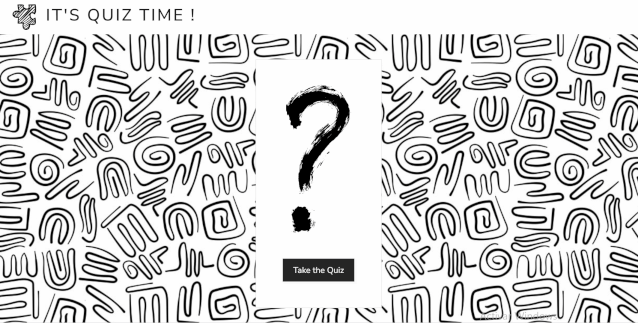
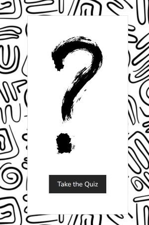
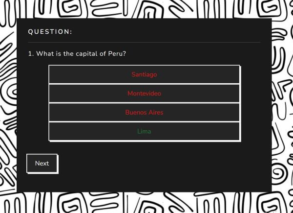
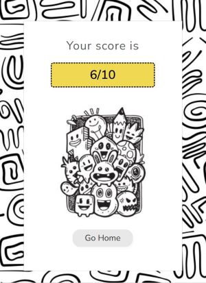

# QUIZ MINIMAL DOODLE

## Description 🤨
In this exercise the great challenge has been to implement APIs for the data and develop all the knowledge learned so far in class.

### Author 🤓
[Yolanda López](https://github.com/yolovi) 

### Technologies used 👩‍💻
* HTML5 (only one file)
* CSS
* [MDB for Bootstrap 5](https://mdbootstrap.com/)
* JavaScript (SPA)
* ECMAScript6

### Skills Achived 👨‍🎓

* Mastering responsive
* Mastering Bootstrap
* Skills in css3
* Load resources from api

### Challenge  🎢
Code a funcional quiz:
* With 10 questions
* As a Single Page Application
* Fetching questions from an API
* Storing results in localStorage (EXTRA)
* Implement a chart with the storaged scores (EXTRA)

## Screenshots 📺

### GIF 
A GIF as background for the game

### Main Menu
Main menu to start game

### Question 
Answer buttons with noted error and correct answer

### Results

## TODO lists ✔

* 10 questions Exercise 
* Modal or insert at beggining with a Start Button.
* Finish Screen with a score as EXTRA to do a chart with some stadistics.

### HTML, CSS
- [x] Structure of html minimal elements
- [x] Structure of html main containers
- [x] Add BS classes to elements
- [x] Beautify results

### JS
- [x] Async Await from API
- [x] Quiz functionality (questions, answers, next/back navigation)
- [x] Count right/wrong points
- [x] Show result points
- [x] Show result sentence (according to points)
- [x] Store points in localStorage (EXTRA)
- [x] Retrieve points from localStorage (EXTRA)
- [x] Put data in chart (EXTRA)

### WEBGRAPHY 💻

* Bootrstap Documentation
* MDB Documentation
* W3Schools
* StackOverflow